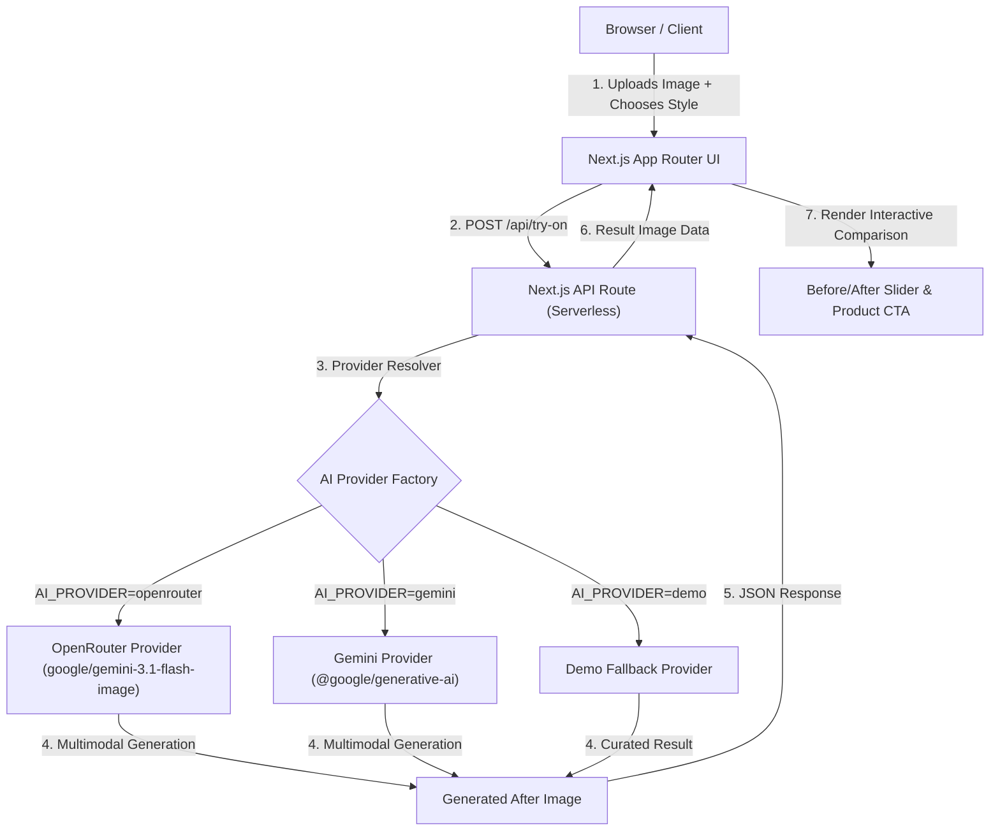

# LustraHair — AI Virtual Hair Try-On

A production-quality virtual hair try-on MVP built for **LustraHair**, a fictional premium beauty & hair brand. Customers can upload a photo, select curated hairstyles and shades, receive realistic AI-generated hair previews, compare Before/After with an interactive slider, and seamlessly connect looks to luxury products.

---

## Overview

Purchasing premium hair extensions and styling changes carries high customer hesitation. LustraHair solves this with an instant, friction-free virtual try-on experience:

$$\textbf{Discover} \longrightarrow \textbf{Upload Photo} \longrightarrow \textbf{Choose Look} \longrightarrow \textbf{AI Try-On} \longrightarrow \textbf{Compare Result} \longrightarrow \textbf{View Product} \longrightarrow \textbf{Take Action}$$

---

## Features

- **Editorial Brand Aesthetic**: Tailored luxury beauty visual identity with warm ivory surfaces, rich charcoal typography, subtle champagne accents, and soft shadows.
- **Drag-and-Drop Photo Upload**: Supports JPG, PNG, and WEBP with client-side dimension optimization ($\le 1024\text{px}$) to prevent payload limits and browser storage overflow.
- **6 Curated Hair Looks & 4 Luxury Shades**: Signature Waves, Silk Straight, Soft Layers, Modern Bob, Defined Curls, and Rich Brunette with Natural Black, Espresso, Chestnut, and Honey Blonde color options.
- **Multi-Stage Processing Experience**: Polished 4-stage visual progress animation (*Analyze photo $\rightarrow$ Map hair $\rightarrow$ Apply style $\rightarrow$ Refine finish*).
- **Interactive Before/After Slider**: Fluid draggable split divider with full mouse pointer capture, mobile touch dragging, and keyboard navigation (`ArrowLeft` / `ArrowRight`).
- **AI Stylist Guidance**: Editorial stylist recommendations paired with each hairstyle.
- **Direct Commerce Intent**: Luxury product cards with pricing (₹), shade selectors, *"Shop This Look"* modal, *"Request Consultation"* notification, and local *"Save Look"* persistence.
- **Try Another Look**: Return directly to style selection while preserving the uploaded photo.
- **Zero Account Requirement**: Session persistence via `sessionStorage` without requiring database setup.

---

## Tech Stack

- **Framework**: Next.js 15 (App Router, Serverless Functions)
- **Frontend**: React 19, TypeScript
- **Styling**: Tailwind CSS 4
- **Icons**: lucide-react
- **AI Providers**: OpenRouter API (`google/gemini-3.1-flash-image`) & Google Generative AI SDK (`@google/generative-ai`)
- **Deployment**: Vercel Native

---

## AI Architecture



### Provider Abstraction & Security
- **Server-Side Execution**: All AI API calls and secret keys (`OPENROUTER_API_KEY`, `GEMINI_API_KEY`) remain strictly on the server. No client-side exposure.
- **Identity Preservation**: Prompts are dynamically generated to strictly preserve the user's face, facial features, skin tone, clothing, background, and lighting while modifying only the hair.
- **Automatic Fallback & Demo Mode**: If no API key is configured or `AI_PROVIDER=demo` is selected, the application functions offline with curated demo assets for testing and demonstrations.

---

## Environment Variables

| Variable | Required | Default | Description |
| :--- | :--- | :--- | :--- |
| `AI_PROVIDER` | No | `openrouter` | Provider choice: `openrouter`, `gemini`, or `demo` |
| `OPENROUTER_API_KEY` | For OpenRouter | — | OpenRouter API Key (e.g. `sk-or-v1-...`) |
| `OPENROUTER_MODEL` | No | `google/gemini-3.1-flash-image` | Model identifier on OpenRouter |
| `OPENROUTER_MAX_TOKENS` | No | `2048` | Max token limit to control credit reservation |
| `GEMINI_API_KEY` | For Direct Gemini | — | Google Gemini API Key |
| `GEMINI_MODEL` | No | `gemini-2.5-flash-image` | Direct Google Gemini model identifier |

---

## Local Setup

1. **Clone the repository**:
   ```bash
   git clone <your-repo-url>
   cd "LustraHair AI Try-On MVP"
   ```

2. **Install dependencies**:
   ```bash
   npm install
   ```

3. **Configure Environment**:
   ```bash
   cp .env.example .env.local
   ```
   Add your OpenRouter or Gemini API key to `.env.local`:
   ```env
   AI_PROVIDER=openrouter
   OPENROUTER_API_KEY=sk-or-v1-your-key-here
   OPENROUTER_MODEL=google/gemini-3.1-flash-image
   ```

4. **Start Development Server**:
   ```bash
   npm run dev
   ```
   Open [http://localhost:3000](http://localhost:3000).

---

## Production Deployment (Vercel)

The project is built on standard Next.js App Router conventions and deploys natively on Vercel without requiring custom `vercel.json` configurations.

### Deployment Steps

1. **Push to GitHub**:
   Ensure all changes are committed and pushed to your GitHub repository (secrets are ignored by `.gitignore`).

2. **Import into Vercel**:
   - Go to [vercel.com/new](https://vercel.com/new).
   - Select your GitHub repository.
   - Framework preset will automatically be detected as **Next.js**.

3. **Set Environment Variables**:
   In the Vercel Project Settings under **Environment Variables**, add:
   - `AI_PROVIDER`: `openrouter` (or `gemini` / `demo`)
   - `OPENROUTER_API_KEY`: `your_openrouter_api_key`
   - `OPENROUTER_MODEL`: `google/gemini-3.1-flash-image` (optional)

4. **Deploy**:
   Click **Deploy**. Vercel will build and deploy the application.

---

## Known Limitations

- **Browser Storage Quotas**: Uploaded photos and generated images are stored in `sessionStorage` during a session. Very large images are downscaled client-side to $\le 1024\text{px}$ to prevent quota errors.
- **Model Variability**: AI image generation is non-deterministic; hair texture and identity blending depend on input lighting and photo clarity.
- **Commerce Flow**: Cart and checkout buttons open demonstration modals; no live payment gateway or backend database is attached.

---

## Production Considerations

- **Persistent Image Storage**: Integrate Amazon S3, Cloudflare R2, or Vercel Blob for storing high-resolution results and user galleries.
- **User Authentication**: Implement NextAuth / Auth0 for saved look histories across devices.
- **Rate Limiting**: Protect `/api/try-on` with Upstash Redis rate limiting to prevent API credit exhaustion.
- **Content Moderation**: Pre-screen uploaded portraits using safety classifiers before AI generation.
- **Image Optimization**: Use dedicated CDN resizing pipelines for instant delivery of comparison results.
